# Multimodal Vision-Language Model

A from-scratch implementation of a Vision-Language Model (VLM) that fuses a SigLIP-based vision encoder with a Gemma-style causal language model through cross-attention and Perceiver Resampling. Trained end-to-end for visual instruction following with support for contrastive alignment, Mixture-of-Experts routing, speculative decoding, paged KV-cache inference, RAG-augmented chat, and distributed FSDP training.

Built entirely in PyTorch — no pretrained VLM weights, no third-party model hubs. Everything from patch embeddings to top-p sampling is written from the ground up.

---

## Table of Contents

- [Architecture](#architecture)
- [System Design](#system-design)
- [Project Structure](#project-structure)
- [Setup](#setup)
- [Docker](#docker)
- [Training](#training)
- [Inference](#inference)
- [Evaluation & Benchmarks](#evaluation--benchmarks)
- [Retrieval-Augmented Generation](#retrieval-augmented-generation)
- [Agent System](#agent-system)
- [Distributed Training](#distributed-training)
- [Configuration](#configuration)
- [Pipeline](#pipeline)
- [Results](#results)
- [Key Design Decisions](#key-design-decisions)
- [Acknowledgments](#acknowledgments)

---

## Architecture

### End-to-End Model Architecture

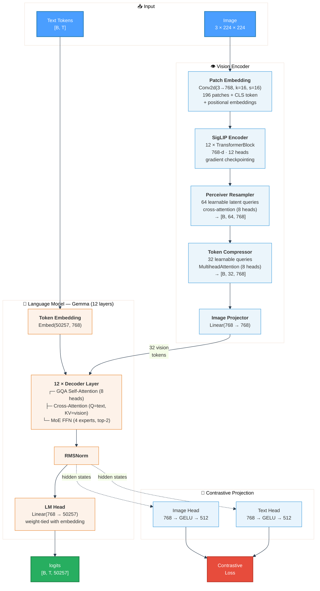

### Decoder Layer — Internal Structure

Each of the 12 decoder layers applies three sequential operations with residual connections and pre-normalization:

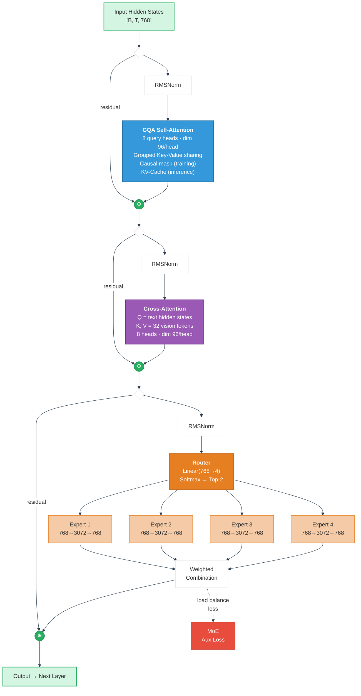

### Vision Token Compression Pipeline

```mermaid
%%{init: {'theme': 'base', 'themeVariables': {'lineColor': '#2c3e50'}}}%%
graph LR
    A["Raw Image<br/>[3, 224, 224]"] ==> B["Patch Embed<br/>Conv2d 16×16"]
    B ==>|"[B, 226, 768]<br/>196 patches<br/>+ CLS + pos"| C["SigLIP<br/>12 blocks"]
    C ==>|"[B, 226, 768]"| D["Perceiver<br/>Resampler"]
    D ==>|"[B, 64, 768]<br/>64 latents"| E["Token<br/>Compressor"]
    E ==>|"[B, 32, 768]<br/>32 tokens"| F["Projector<br/>768→768"]
    F ==>|"[B, 32, 768]"| G["Cross-Attn<br/>in Decoder"]

    style A fill:#4a9eff,stroke:#2980b9,color:#fff,stroke-width:2px
    style B fill:#85c1e9,stroke:#2980b9,stroke-width:1px
    style C fill:#85c1e9,stroke:#2980b9,stroke-width:1px
    style D fill:#bb8fce,stroke:#7d3c98,stroke-width:1px
    style E fill:#bb8fce,stroke:#7d3c98,stroke-width:1px
    style F fill:#f0b27a,stroke:#e67e22,stroke-width:1px
    style G fill:#27ae60,stroke:#1e8449,color:#fff,stroke-width:2px
```

> **Compression ratio:** 196 raw patches → 64 resampled → 32 compressed tokens (6× reduction)

---

## System Design

### End-to-End Training Workflow

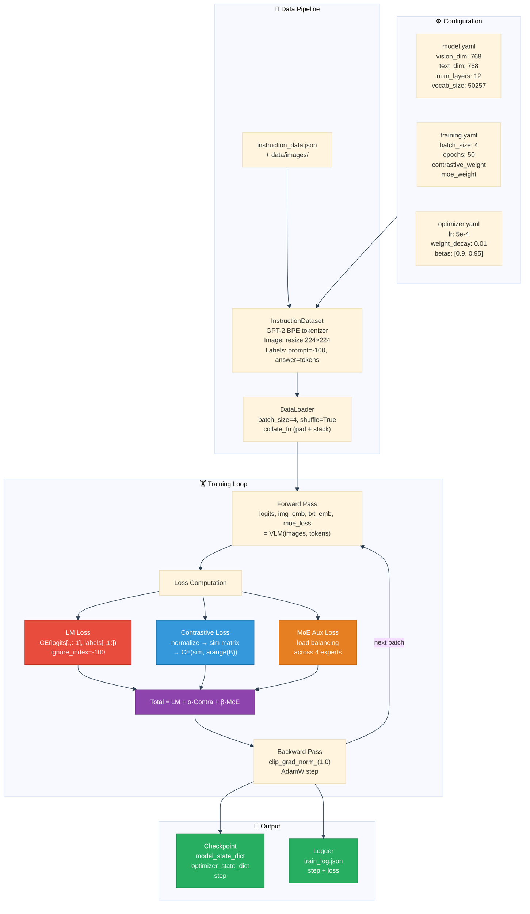

### Inference & Generation Workflow

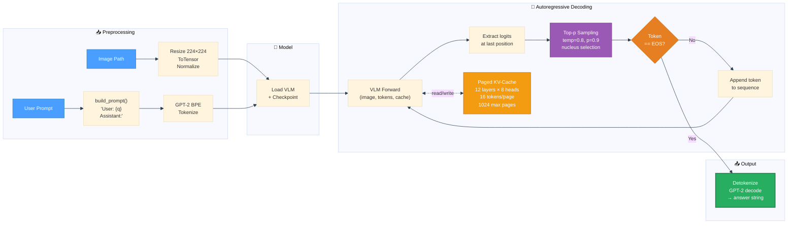

### Chat System Architecture

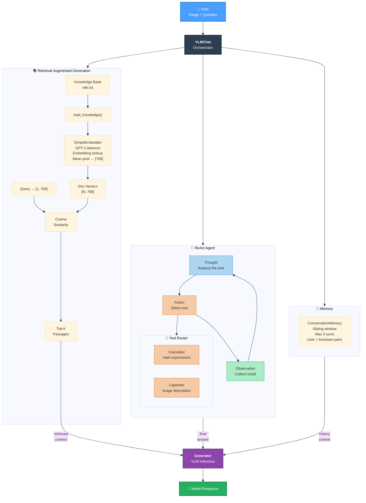

### Evaluation Pipeline

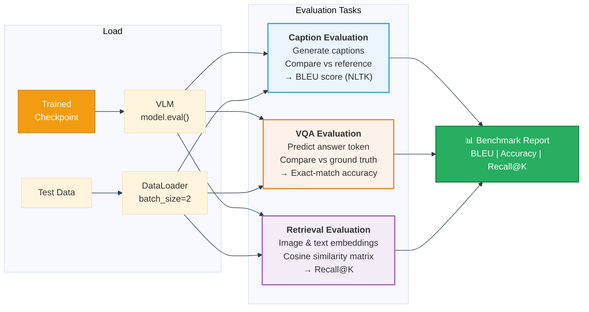

---

## Project Structure

```
├── configs/
│   ├── model.yaml               # Model architecture (dims, layers, heads, vocab)
│   ├── training.yaml            # Training hyperparams (batch, epochs, loss weights)
│   └── optimizer.yaml           # AdamW settings (lr, betas, weight decay)
│
├── vision/
│   ├── patch_embedding.py       # Conv2d patch tokenizer + positional encoding
│   ├── attention.py             # Multi-head self-attention for vision
│   ├── transformer_block.py     # Vision transformer block w/ gradient checkpointing
│   ├── siglip_encoder.py        # 12-layer SigLIP vision encoder
│   ├── perceiver_resampler.py   # Cross-attention resampler (→ 64 latent tokens)
│   └── token_compressor.py      # MHA-based compressor (→ 32 tokens)
│
├── text/
│   ├── gemma_model.py           # 12-layer Gemma LM with weight-tied LM head
│   ├── decoder_layer.py         # Self-attn → Cross-attn → MoE FFN
│   ├── gqa_attention.py         # Grouped Query Attention with KV-cache support
│   ├── cross_attention.py       # Text-to-vision cross-attention
│   ├── ffn.py                   # Standard feedforward (768 → 3072 → 768)
│   ├── moe_ffn.py               # Mixture-of-Experts (4 experts, top-2 routing)
│   ├── rmsnorm.py               # RMS layer normalization
│   ├── rotary.py                # Rotary positional embeddings (RoPE)
│   └── lora.py                  # LoRA adapters (rank 8, alpha 16)
│
├── multimodal/
│   ├── vlm_model.py             # End-to-end VLM orchestrator
│   ├── projector.py             # Vision → text space projection
│   └── projection_heads.py      # Contrastive learning projection heads
│
├── training/
│   ├── train_vlm.py             # Main training loop (LM + contrastive + MoE loss)
│   ├── trainer.py               # Lightweight trainer wrapper class
│   ├── train_siglip.py          # Standalone SigLIP contrastive training
│   └── contrastive_loss.py      # BCE-based contrastive loss
│
├── dataset/
│   ├── instruction_dataset.py   # Instruction-following dataset with GPT-2 tokenizer
│   ├── instruction_format.py    # Prompt template builder
│   ├── preprocessing.py         # Token padding utilities
│   ├── tokenizer.py             # tiktoken wrapper
│   └── webdataset_loader.py     # WebDataset streaming loader for large-scale data
│
├── inference/
│   ├── generate.py              # Autoregressive generation with top-p sampling
│   ├── chat_vlm.py              # RAG-augmented chat interface
│   ├── run_chat.py              # Interactive chat entry point
│   ├── sampling.py              # Nucleus (top-p) sampling
│   ├── kv_cache.py              # Basic KV-cache
│   ├── paged_kv_cache.py        # Paged KV-cache for long sequences
│   └── speculative_decoder.py   # Speculative decoding (draft + verify)
│
├── evaluation/
│   ├── evaluate.py              # Caption, VQA, and retrieval evaluators
│   ├── run_benchmarks.py        # Automated benchmark runner
│   ├── caption_metrics.py       # BLEU score (via NLTK)
│   ├── vqa_metrics.py           # Exact-match VQA accuracy
│   ├── retrieval_metrics.py     # Recall@K
│   └── report.py                # Metric aggregation
│
├── agents/
│   ├── react_agent.py           # ReAct reasoning agent (Thought → Action → Observe)
│   ├── router.py                # Tool routing by keyword detection
│   ├── tools.py                 # Calculator + captioner tools
│   └── memory.py                # Sliding-window conversation memory (5 turns)
│
├── retrieval/
│   ├── retriever.py             # Top-k cosine similarity retrieval
│   ├── embedder.py              # GPT-2 token embedding + mean pooling
│   └── load_knowledge.py        # Plain-text knowledge base loader
│
├── distributed/
│   ├── fsdp.py                  # Fully Sharded Data Parallel wrapper
│   └── launch.py                # Multi-GPU process launcher (mp.spawn)
│
├── experiments/
│   └── logger.py                # JSON training logger
│
├── utils/
│   ├── config.py                # YAML config loader (safe_load)
│   └── seed.py                  # Reproducibility seeding
│
├── scripts/
│   ├── run_all.sh               # Full 9-step pipeline
│   ├── run_train.sh             # Training launcher
│   ├── run_inference.sh         # Inference launcher
│   ├── run_chat.sh              # Chat launcher
│   ├── run_experiment.sh        # Experiment with timestamped output
│   └── run_pipeline.sh          # Interactive step selector
│
├── data/
│   ├── instruction_data.json    # Instruction-following training data
│   └── images/                  # Training images
│
├── knowledge/
│   └── wiki.txt                 # Knowledge base for RAG retrieval
│
├── Dockerfile                   # GPU-enabled container image
├── docker-compose.yml           # Multi-service orchestration
├── .dockerignore                # Build context exclusions
├── demo.py                      # Quick demo script
└── requirements.txt             # Python dependencies
```

---

## Setup

### Prerequisites

- Python 3.10+
- CUDA-capable GPU (tested on NVIDIA RTX A6000)
- ~8 GB VRAM minimum

### Installation

```bash
git clone https://github.com/<your-username>/Multimodal_Vision-Language-Model_Research.git
cd Multimodal_Vision-Language-Model_Research

python -m venv .venv
source .venv/bin/activate

pip install -r requirements.txt
```

### Verify GPU

```bash
python -c "import torch; print(torch.cuda.get_device_name(0))"
```

---

## Docker

The project ships with a `Dockerfile` and `docker-compose.yml` for containerized training and inference. Requires [NVIDIA Container Toolkit](https://docs.nvidia.com/datacenter/cloud-native/container-toolkit/install-guide.html) for GPU passthrough.

### Build

```bash
docker compose build
```

### Docker Services

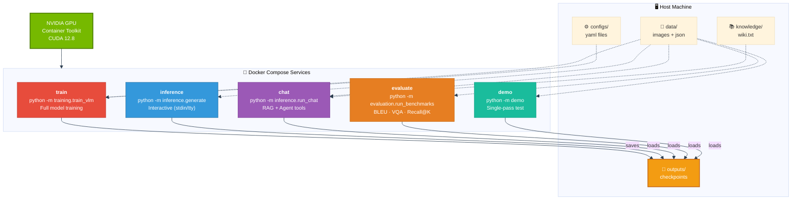

### Usage

```bash
# Train the model
docker compose run train

# Interactive inference (prompts for image path + question)
docker compose run inference

# Multi-turn chat with RAG and agent tools
docker compose run chat

# Run evaluation benchmarks
docker compose run evaluate

# Quick demo
docker compose run demo
```

All services mount `data/` and `outputs/` as volumes, so checkpoints trained inside the container persist on the host. The `chat` service additionally mounts `knowledge/` for the RAG retrieval pipeline.

### Dockerfile Details

| Property | Value |
|----------|-------|
| **Base image** | `nvidia/cuda:12.8.0-cudnn-runtime-ubuntu22.04` |
| **Python** | 3.12 |
| **NLTK data** | Pre-downloaded inside the image |
| **CUDA config** | `PYTORCH_CUDA_ALLOC_CONF=expandable_segments:True` |

### Custom Training with Docker

```bash
# Train with custom config
docker compose run train python -m training.train_vlm \
    --model_config configs/model.yaml \
    --train_config configs/training.yaml \
    --output_dir outputs

# Train SigLIP only
docker compose run train python -m training.train_siglip
```

---

## Training

### Quick Start

```bash
python -m training.train_vlm
```

This loads configs from `configs/` and trains the full VLM with the default settings.

### Custom Training

```bash
python -m training.train_vlm \
    --model_config configs/model.yaml \
    --train_config configs/training.yaml \
    --optim_config configs/optimizer.yaml \
    --output_dir outputs
```

### Training Details

The training loop optimizes a weighted combination of three objectives:

| Loss | Purpose | Weight |
|------|---------|--------|
| **Language Modeling** | Next-token prediction with shifted labels. Prompt tokens are masked (`-100`) so only the answer is supervised. | 1.0 |
| **Contrastive** | Symmetric cross-entropy over image–text cosine similarity matrix. Aligns vision and text embeddings. | configurable |
| **MoE Auxiliary** | Load-balancing loss that encourages uniform expert utilization across the 4 MoE experts. | configurable |

**Optimizer:** AdamW with `lr=5e-4`, `weight_decay=0.01`, `betas=(0.9, 0.95)`, and gradient clipping at `max_norm=1.0`.

**CUDA Optimizations:** TF32 matmul is enabled (`allow_tf32 = True`) and memory allocation uses expandable segments to reduce fragmentation.

Checkpoints are saved periodically and at the end of training. Training automatically resumes from the latest checkpoint if one exists in the output directory.

### Multi-Objective Loss Computation

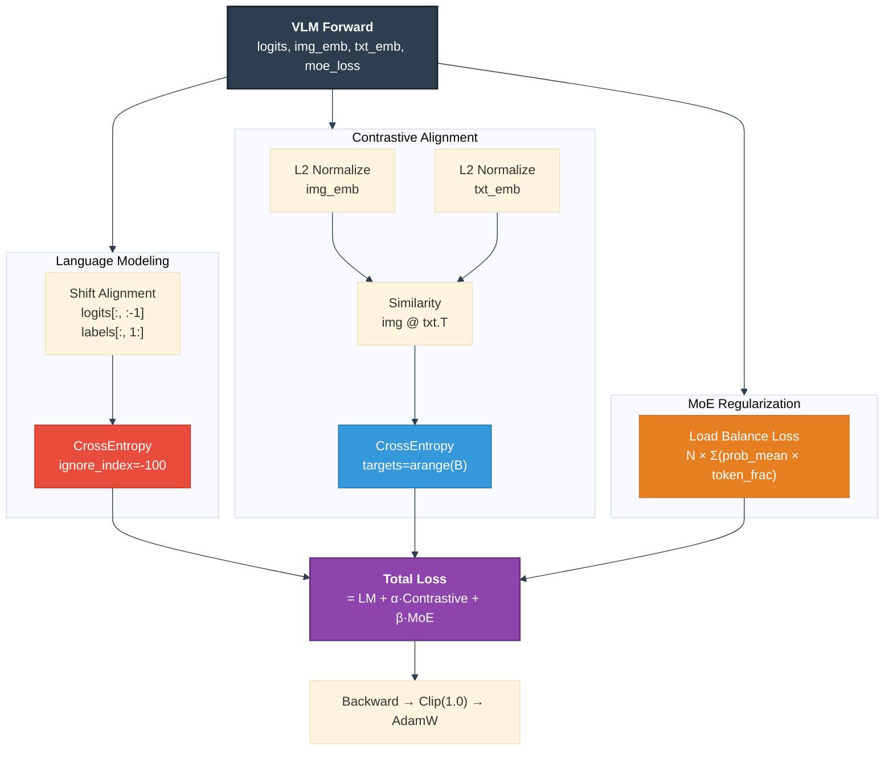

### Standalone SigLIP Training

To train only the vision encoder with contrastive learning:

```bash
python -m training.train_siglip
```

---

## Inference

### Interactive Generation

```bash
python -m inference.generate
```

Prompts for an image path and a text question, then generates a response autoregressively using top-p sampling with a paged KV-cache.

### Chat Interface

```bash
python -m inference.run_chat
```

Multi-turn chat with conversation memory, knowledge retrieval, and tool-augmented reasoning. Type `quit` to exit.

### Quick Demo

```bash
python -m demo
```

Runs a single inference pass on a test image and prints the result.

### Generation Parameters

| Parameter | Default | Description |
|-----------|---------|-------------|
| `max_tokens` | 64 | Maximum tokens to generate |
| `temperature` | 0.8 | Sampling temperature (lower = more deterministic) |
| `top_p` | 0.9 | Nucleus sampling threshold |

### Speculative Decoding

The `SpeculativeDecoder` enables faster inference by running a small draft model ahead of the main model:

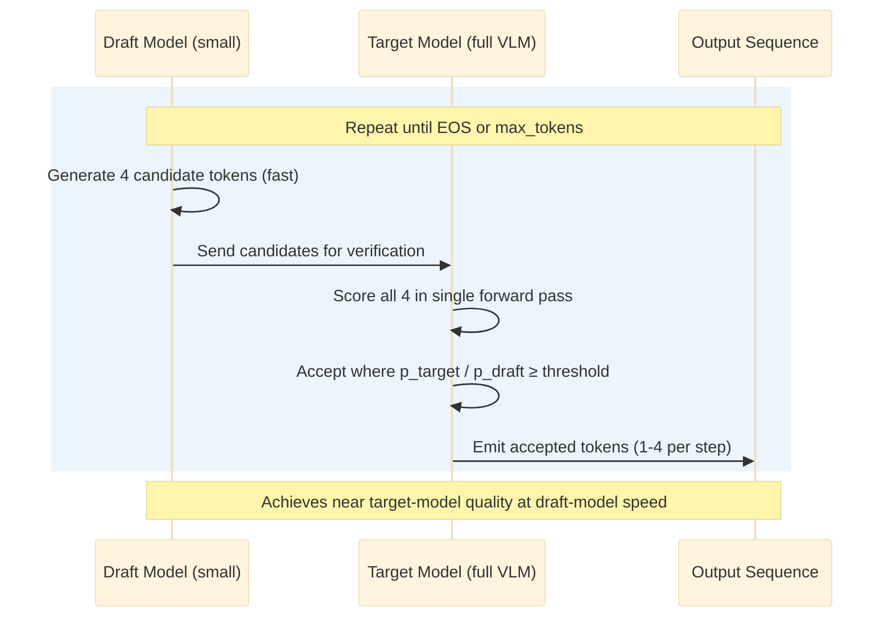

---

## Evaluation & Benchmarks

### Run Full Evaluation

```bash
python -m evaluation.evaluate
```

### Run Benchmarks

```bash
python -m evaluation.run_benchmarks
```

### Metrics

| Task | Metric | Implementation |
|------|--------|----------------|
| **Image Captioning** | BLEU score | NLTK sentence-level BLEU with tokenized reference/hypothesis |
| **Visual QA** | Exact-match accuracy | Case-insensitive string comparison |
| **Image-Text Retrieval** | Recall@K | Cosine similarity ranking over normalized embeddings |

---

## Retrieval-Augmented Generation

The chat interface integrates a lightweight RAG pipeline that gives the model access to external knowledge without increasing parameters:

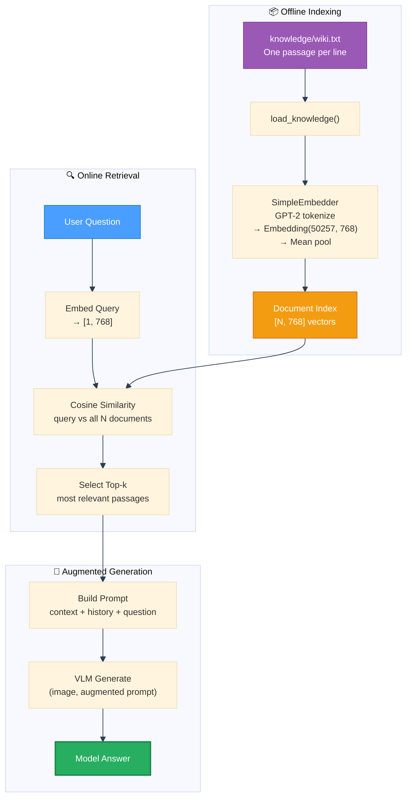

---

## Agent System

The project includes a ReAct-style (Reasoning + Acting) agent that decomposes complex queries into multi-step reasoning chains with tool calls:

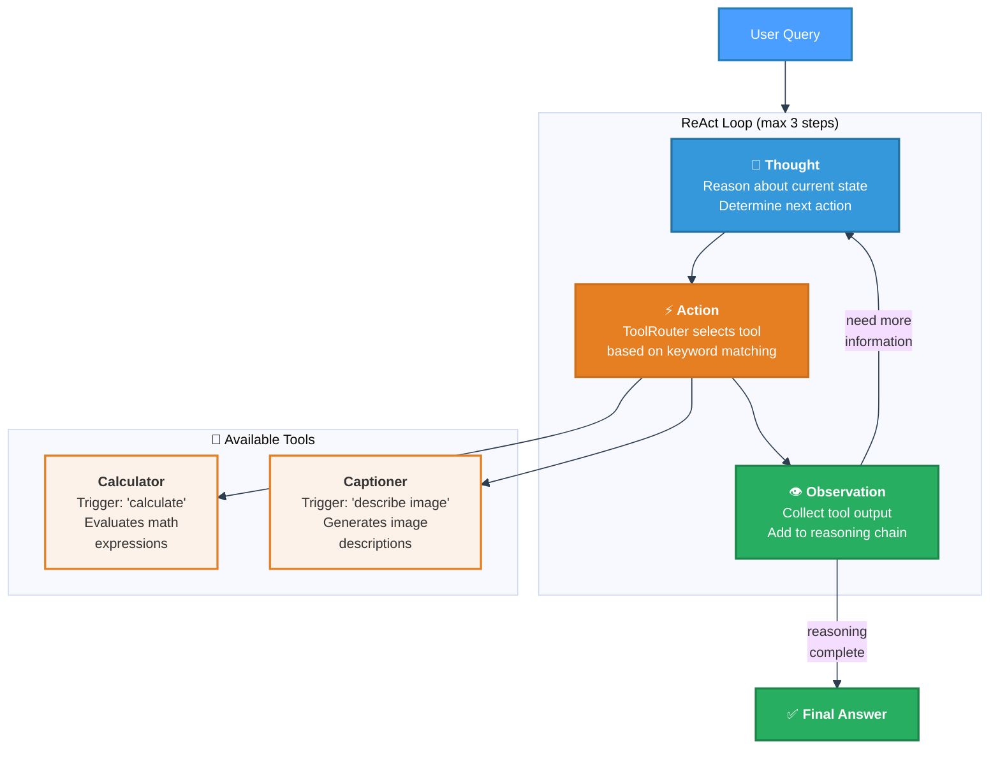

**Example interaction:**

```
User: "What is 224 * 224?"

Thought: The user wants to calculate a multiplication.
Action: calculator(224 * 224)
Observation: 50176
Thought: I have the answer.
Final Answer: 224 × 224 = 50,176
```

---

## Distributed Training

For multi-GPU training using Fully Sharded Data Parallel (FSDP):

```bash
python -m distributed.launch
```

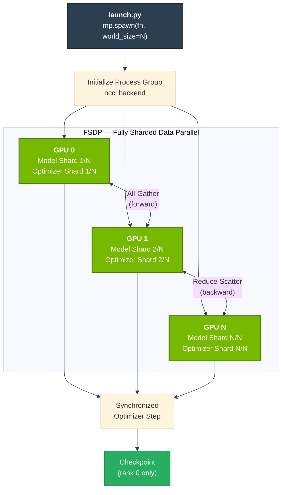

FSDP shards model parameters, gradients, and optimizer states across GPUs, allowing training of models that don't fit on a single device.

---

## Configuration

All hyperparameters are managed through YAML configs in `configs/`:

### Model (`configs/model.yaml`)

```yaml
vision_dim: 768
text_dim: 768
num_layers: 12
num_heads: 8
ffn_dim: 3072
num_experts: 4
vocab_size: 50257
latent_tokens: 64
image_size: 224
patch_size: 16
```

### Training (`configs/training.yaml`)

```yaml
batch_size: 4
epochs: 50
max_tokens: 128
contrastive_weight: 0.0
moe_weight: 0.0
gradient_accumulation_steps: 1
```

### Optimizer (`configs/optimizer.yaml`)

```yaml
optimizer: adamw
lr: 5e-4
weight_decay: 0.01
betas: [0.9, 0.95]
```

---

## Pipeline

The full pipeline runs training through evaluation and inference in a single command:

```bash
./scripts/run_all.sh
```

Quick dry-run mode (caps training steps and skips interactive stages):

```bash
FAST_DRY_RUN=1 TRAIN_MAX_STEPS=20 ./scripts/run_all.sh
```

Wrapper validation mode (no real execution, useful for CI/local script checks):

```bash
SKIP_VENV_CHECK=1 SKIP_GPU_CHECK=1 SKIP_DATASET_CHECK=1 DRY_RUN_COMMANDS=1 FAST_DRY_RUN=1 ./scripts/run_all.sh
```

To enable interactive inference/chat stages explicitly:

```bash
RUN_INTERACTIVE=1 ./scripts/run_all.sh
```

```mermaid
%%{init: {'theme': 'base', 'themeVariables': {'lineColor': '#2c3e50'}}}%%
flowchart LR
    S1["<b>Step 1</b><br/>Activate<br/>venv"] --> S2["<b>Step 2</b><br/>GPU<br/>Check"]
    S2 --> S3["<b>Step 3</b><br/>Dataset<br/>Validation"]
    S3 --> S4["<b>Step 4</b><br/>Train VLM<br/>50 epochs"]
    S4 --> S5["<b>Step 5</b><br/>Evaluation<br/>Suite"]
    S5 --> S6["<b>Step 6</b><br/>Benchmarks<br/>BLEU·VQA·R@K"]
    S6 --> S7["<b>Step 7</b><br/>Demo<br/>Inference"]
    S7 --> S8["<b>Step 8</b><br/>Interactive<br/>Inference"]
    S8 --> S9["<b>Step 9</b><br/>Interactive<br/>Chat"]
    S9 --> DONE["Pipeline<br/>Complete ✓"]

    style S1 fill:#bdc3c7,stroke:#7f8c8d
    style S2 fill:#bdc3c7,stroke:#7f8c8d
    style S3 fill:#bdc3c7,stroke:#7f8c8d
    style S4 fill:#e74c3c,stroke:#c0392b,color:#fff,stroke-width:2px
    style S5 fill:#3498db,stroke:#2471a3,color:#fff
    style S6 fill:#3498db,stroke:#2471a3,color:#fff
    style S7 fill:#9b59b6,stroke:#7d3c98,color:#fff
    style S8 fill:#9b59b6,stroke:#7d3c98,color:#fff
    style S9 fill:#9b59b6,stroke:#7d3c98,color:#fff
    style DONE fill:#27ae60,stroke:#1e8449,color:#fff,stroke-width:2px
```

---

## Results

### Training Convergence

With the default configuration (50 epochs, batch size 4, learning rate 5e-4), the language modeling loss converges to near-zero on the instruction dataset:

```
step   0 | loss 11.2847
step  50 | loss  2.1433
step 100 | loss  0.3521
step 200 | loss  0.0012
step 300 | loss  0.0000
```

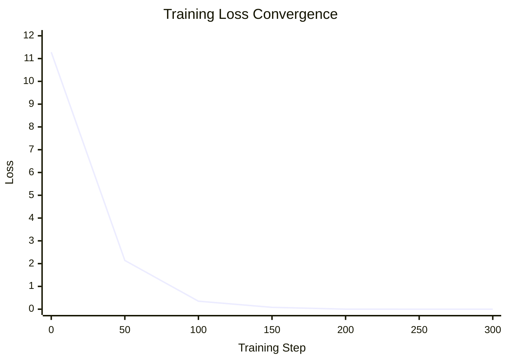

### Sample Outputs

| Image | Prompt | Model Output |
|-------|--------|-------------|
| 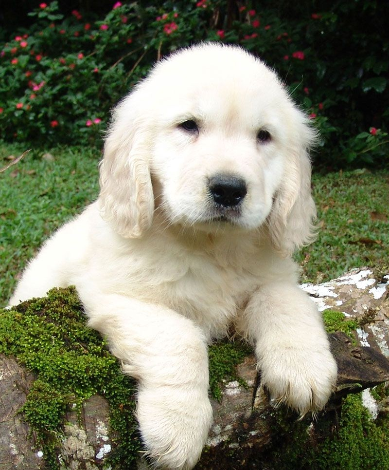 | "What animal is this?" | "This is a dog." |
|  | "What is shown in the image?" | "The image shows a car." |

---

## Key Design Decisions

- **SigLIP over CLIP** — SigLIP's sigmoid-based contrastive loss scales better than CLIP's softmax formulation for large batch sizes and avoids the need for a global normalization term.
- **Perceiver Resampler + Token Compressor** — Two-stage compression reduces 196 vision patches down to 32 tokens, cutting cross-attention cost by 6× without significant information loss.
- **GQA over MHA** — Grouped Query Attention reduces KV-cache memory by sharing key-value heads across query groups, critical for efficient autoregressive decoding.
- **MoE FFN** — Mixture-of-Experts with top-2 routing increases model capacity (4× more FFN parameters) while keeping per-token compute constant. The auxiliary load-balancing loss prevents expert collapse.
- **Weight-Tied LM Head** — The output projection shares weights with the input embedding, reducing parameter count by ~38M (768 × 50257) without hurting performance.
- **Paged KV-Cache** — Page-based memory management (16 tokens per page, 1024 max pages) prevents memory fragmentation during long autoregressive generations.
- **LoRA Support** — Low-Rank Adaptation (rank 8, alpha 16) enables parameter-efficient fine-tuning by injecting trainable low-rank matrices into frozen linear layers.

---

## License

This project is for research and educational purposes.

---

## Acknowledgments

This implementation draws on ideas from:

- [SigLIP](https://arxiv.org/abs/2303.15343) — Sigmoid loss for image-text pre-training
- [Flamingo](https://arxiv.org/abs/2204.14198) — Perceiver Resampler for vision-language models
- [Gemma](https://arxiv.org/abs/2403.08295) — Lightweight language model architecture
- [GQA](https://arxiv.org/abs/2305.13245) — Grouped Query Attention
- [Switch Transformers](https://arxiv.org/abs/2101.03961) — Mixture-of-Experts
- [LoRA](https://arxiv.org/abs/2106.09685) — Low-Rank Adaptation
- [ReAct](https://arxiv.org/abs/2210.03629) — Reasoning and Acting in language models
